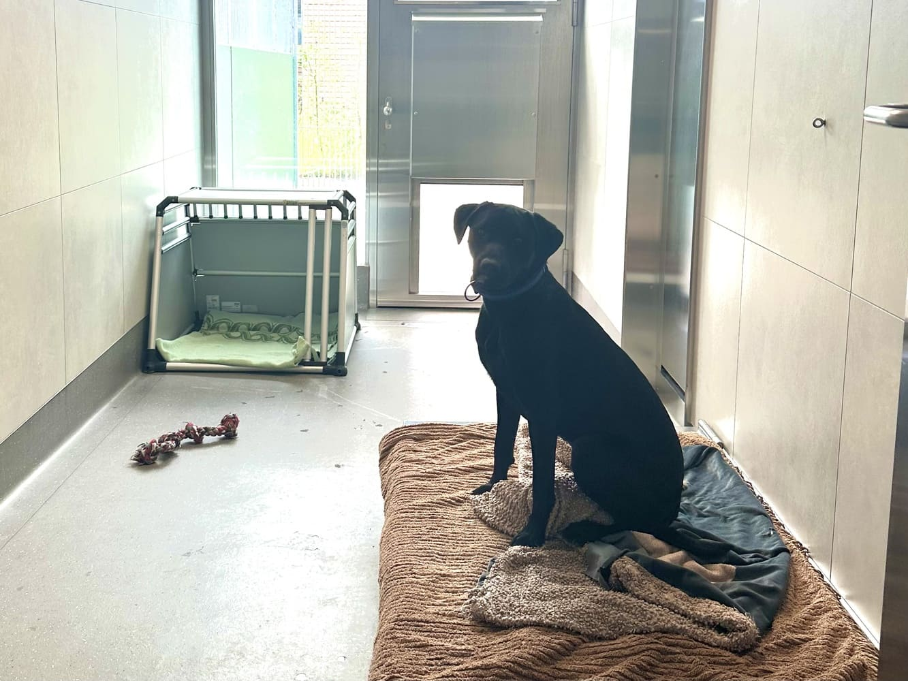

+++
title = "Gefangen hinter Gittern - Auswirkungen der Käfighaltung auf Hunde am Beispiel eines Schweizer Tierheims"
date = "2025-12-01"
draft = false
pinned = false
tags = ["Maturaarbeit"]
image = "tempimageifbd89-2.jpg"
+++
## **Heutzutage landen Hunde schneller in Tierheimen, als man vermuten würde. Einerseits geschieht dies durch Aussetzungen, anderseits, weil viele Menschen im Alter ihren Tieren nicht mehr gerecht werden können. Hinzu kommt die Realität des kleinen, süssen, verspielten Hundes, die sich im Alltag als weitaus anstrengender erweisen kann, als ursprünglich gedacht. In solchen Momenten tritt das Tierheim in Erscheinung. Es ist nicht nur eine Auffangstation, sondern zeigt auch, wie sehr das zukünftige Leben der Hunde von den Menschen abhängt. Doch wie genau dieses Leben im Tierheim aussieht, welche Auswirkungen es hat und wie sich die Mitarbeitenden bemühen, den Aufenthalt für die Tiere so angenehm wie möglich zu gestalten, vermittelt ein Blick ins «Berner Tierzentrum».**

Von **Cindy Nilovic**

**Morgenstille und Tierheimatmosphäre**

Ein ruhiger, angenehmer Mittwochmorgen: Der Himmel ist strahlend blau, die Sonne scheint und die Vögel zwitschern. Es riecht nach frischem Gras, während das Knirschen der Schuhsohlen auf dem Kies den Weg begleitet. Schon bald erscheint ein grosses, graues Gebäude, dessen Logo – ein roter Uhu – ins Auge fällt. Die Glastüre öffnet sich und gibt den Blick frei auf das seit 2022 bestehende *«Berner Tierzentrum»*. Auffällig sind der

Empfangstisch sowie der Kontrast der grau-roten Wandgestaltung. Vor dem Empfangstisch wird man von Kristin Brügger, Leiterin des Hundebereichs, freundlich begrüsst und in einen Besprechungsraum geführt. Sofort wird spürbar, dass sie ihren Beruf mit Leidenschaft ausübt.

Es ist 11:02 Uhr, und im Raum herrscht eine angenehme Atmosphäre. An der linken Wand hängen vier Bilder – eines von einer Katze, drei von Hunden. Darüber schmückt eine Girlande mit farbenfrohen, liebevoll gezeichneten Motiven den Raum. Auf der rechten Seite füllt ein grosses Fenster die gesamte Wand. Sonnenlicht strömt herein und gibt den Blick frei auf den Wald hinter dem Tierzentrum. Dieses Zusammenspiel erzeugt ein stimmiges und wohltuendes Gesamtbild.

**Einblicke einer Leiterin des Hundebereichs**

Seit vier Jahren arbeitet Kristin Brügger im *«Berner Tierzentrum»* in ihrem Traumberuf als Tierheimmitarbeiterin. Seit über einem Jahr ist sie dort als leitende Verantwortliche tätig. Ihren beruflichen Werdegang beschreibt sie selbst als «etwas speziell»: *«Zuerst habe ich die KV-Lehre absolviert und im Büro gearbeitet. Aber eigentlich wusste ich schon immer, dass ich mit Tieren arbeiten wollte. Lehrstellen sind in diesem Bereich jedoch schwer zu finden. Nach meiner KV-Lehre habe ich deshalb eine verkürzte Lehre als Tierpflegerin gesucht und abgeschlossen. Wenn man bereits eine Grundausbildung hat, dauert diese nur zwei Jahre. Danach bin ich im Berner Tierzentrum geblieben.»* Das Interesse am Tierschutz begleitet Kristin Brügger schon immer. Sie liebt die Arbeit mit Tieren, möchte Hunden im Tierheim helfen und hat selbst einen Hund aus dem Tierschutz adoptiert. Über ihre Arbeit sagt sie: *«Das Faszinierende sind die spannenden Geschichten, die man mitbekommt – aber es kann auch sehr emotional werden. Deshalb muss man lernen, damit umzugehen.»* Besonders erfüllend findet sie es, die Fortschritte der Hundemitzuerleben: Tiere, die in schlechtem Zustand oder mit auffälligem Verhalten ins Tierheim kommen, entwickeln sich durch gezielte Arbeit weiter und können an neue Halter vermittelt werden. *«Das ist für mich das Coolste an der ganzen Arbeit»*, so Kristin. Oft wird sie gefragt, wie sie es aushalte, im Tierheim zu arbeiten, da man dort Dinge sieht, die man lieber nicht sehen möchte. Ihre Antwort ist klar: *«Gerade in solchen Situationen finde ich es wichtig, dass man genau hinschaut – und wenn ich das kann, mache ich es gerne.»* In den letzten Jahren hat sie sich zunehmend auf Problemfälle konzentriert: Hunde, die als schwierig oder gefährlich eingestuft werden. Genau mit diesen Hunden möchte sie arbeiten, denn sie gelten im Tierheim oft als *«Schattenhunde»* – übersehen und kaum vermittelbar.

**Aktuelle Lage im Berner Tierzentrum**

Momentan herrscht laut Kristin im Berner Tierzentrum eine eher stressige Phase, da die meisten Plätze belegt sind. In der Regel kommt es zu sogenannten *«Wechseln»* – wie auch derzeit. Werden Hunde vermittelt, gehen sie zunächst für drei Wochen in ein *«Probe-Wohnen»*. Während dieser Zeit bleiben die frei gewordenen Boxen leer, falls es zwischen Hund und Halter nicht funktionieren sollte, sodass die Tiere zurückkehren können. Insgesamt verfügt das Berner Tierzentrum über 18 Boxen, von denen derzeit einige reserviert sind. Aufgrund der hohen Nachfrage wurde zusätzlich eine Warteliste eingerichtet.

**Individuelle Stressbelastung in der Käfighaltung**

Im Berner Tierzentrum werden die Hunde in der Regel einzeln gehalten, was jedoch variieren kann. Leben Hunde aus demselben Haushalt zusammen und sind bereits aneinander gewöhnt, dürfen sie auch gemeinsam untergebracht werden. Manche Hunde hingegen vertragen sich nicht mit anderen, sodass eine Gruppenhaltung ausgeschlossen ist – insbesondere nachts, wenn keine Mitarbeitenden anwesend sind und Konflikte nicht verhindert werden könnten. Dennoch achten die Verantwortlichen darauf, dass die Hunde tagsüber im Auslauf ausreichend Zeit miteinander verbringen und so auch Gruppen- erfahrungen sammeln können. Da während dieser Zeit stets Betreuungspersonen anwesend sind, kommt es dabei in der Regel zu keinen Problemen.

Auf die Frage, wie stark der psychische Stress der Käfighaltung für Hunde auf einer Skala von eins bis zehn einzuschätzen sei, nennt Kristin einen Durch-schnittswert von fünf. Dies hänge jedoch stark vom einzelnen Hund ab. Aus ihrer Erfahrung weiss sie, dass es auch Tiere mit einem Stresslevel von zehn gab. So beispielsweise ein Labradormischling, der mehrere Monate im Tierheim verbrachte und von Anfang an nicht mit der Situation zurechtkam – bis zu seiner Vermittlung. *«Nicht, dass es seine Gesundheit beeinträchtigt hätte, aber natürlich seine Psyche. Stress geht immer auf die Psyche»*, erklärt Kristin. Es gibt jedoch auch gegenteilige Fälle: Manche Hunde leben über Jahre hinweg im Tierheim und gewöhnen sich an diese Umgebung. Kristin nennt das Beispiel eines Hundes, der mehr als vier Jahre im *«Berner Tierschutz»* verbrachte. Für ihn wurde das Leben im Tierheim zur Normalität, wodurch er zunehmend zur Ruhe kam. Sein Stresslevel würde sie mit einer eins bewerten. Insgesamt zeigt sich, dass das Stressempfinden individuell stark variiert. Daher betont Kristin, dass die *«fünf*» als goldene Mitte eine realistische Gesamteinschätzung darstellt.

**Herausforderung der Käfighaltung**

Kristin beschreibt die grösste Herausforderung der Käfighaltung sehr deutlich: «*Das Hauptproblem, das am meisten Zeit in Anspruch nimmt, ist sicherzustellen, dass die Hunde genügend Beschäftigung erhalten und möglichst viel Sozialkontakt haben – damit sie letztlich glücklich sind.»* Es ist ihr ein besonderes Anliegen, dass sich die Hunde im Berner Tierzentrum wohlfühlen. Dafür setzt sie alles in ihrer Macht Stehende ein, auch wenn die Situation schwierig sein kann – denn jeder Hund ist anders. Als Beispiel nennt sie einen belgischen Schäferhund, der besonders viel Beschäftigung benötigt, was die Betreuung anspruchsvoller macht. Im Gegensatz dazu sei eine französische Bulldogge wesentlich unkomplizierter, da sie andere Bedürfnisse habe. Entscheidend ist für Kristin, jedem Hund individuell gerecht zu werden.

**Zeit im Freien - Spaziergänge und Auslauf**

Auf die Frage, wie lange die Hunde im Tierzentrum nach draussen geführt werden, antwortet Kristin: *«Es ist sehr unterschiedlich – von Hund zu Hund. Es hängt davon ab, wie viele Hunde wir aktuell im Tierheim haben, wie viel Zeit wir aufwenden können und welche Rasse es ist. Wir haben auch ehrenamtliche Hundespaziergänger, die mit unseren Hunden laufen gehen. Das hilft uns enorm, denn wir Tierpfleger/innen allein könnten dafür zu wenig Zeit aufbringen.»* Kristin betont, dass es ihr und den anderen Mitarbeitenden besonders wichtig ist, dass die Hunde ausreichend Zeit im Freien verbringen können. Im Durchschnitt werden mit den Hunden einstündige Spaziergänge unternommen, was ihrer Ansicht nach ein *«schöner Schnitt»* ist – vor allem im Vergleich zu anderen Institutionen. Zusätzlich steht den Hunden Auslauf im Freien zur Verfügung. Darüber hinaus gibt es Tage, an denen bestimmte Hunde zwei bis drei Stunden draussen sein können, wenn freiwillige Hundespaziergänger helfen. Auf der anderen Seite gibt es aber auch Hunde, die ausschliesslich von den internen Tierpfleger/innen betreut werden können. Dabei handelt es sich meist um Problemfälle, die deshalb weniger Zeit draussen verbringen, da der Alltag der Mitarbeitenden ohnehin sehr anspruchsvoll ist.

**Spiel und Beschäftigung im Tierzentrum**

Kristin und ihre Mitarbeiter/innen bieten den Hunden verschiedene Beschäftigungen an, zum Beispiel Futtersuchen mit sogenannten *«Schnüffelteppichen»*. Kristin erklärt dazu: *«In Schnüffelteppichen kann man Futter verstecken, und die Hunde sind eine Zeit lang damit beschäftigt, es zu finden.»* Darüber hinaus gibt es sogenannte *«Kongs»*, die mit Nassfutter gefüllt und anschliessend in den Kühlschrank gelegt werden. Daraus entsteht eine Art *«Hundeglace»*, die die Hunde mit der Zunge aus dem *«Kong»* herauslecken können. Dieses Spielzeug beschäftigt sie ungefähr eine halbe Stunde. Auch im Auslauf stehen zahlreiche Strukturen zur Verfügung, darunter kleine Podeste, ein Hundepool und ein Tunnel. Nicht zu vergessen ist, dass regelmässig Hunde vermittelt werden

